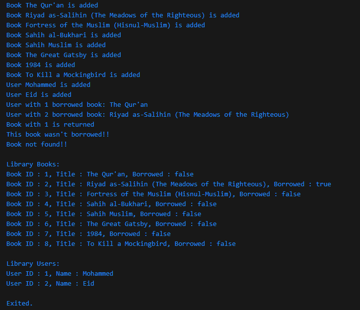

# Library System

## Project Description

This project is a simple library system implemented in Dart. It allows users to manage books and users, perform operations such as borrowing and returning books, and display the current state of the library.

---

## Features
1. **Books Management**:
   - Add books to the library.
   - Track whether a book is borrowed or available.

2. **Users Management**:
   - Add users to the system.

3. **Operations**:
   - Borrow a book by a user.
   - Return a book to the library.
   - Display all books and users.

---

## Classes and Methods

### `Books` Class
- Attributes:
  - `id`: Unique identifier for the book.
  - `title`: Name of the book.
  - `borrowed`: Status of the book (borrowed or available).
- Method:
  - `displayInfo()`: Displays the book's information.

### `Users` Class
- Attributes:
  - `id`: Unique identifier for the user.
  - `name`: Name of the user.
- Method:
  - `displayInfo()`: Displays the user's information.

### `Library` Class
- Attributes:
  - `books`: List of books in the library.
  - `users`: List of users in the library.
- Methods:
  - `addBook(Book book)`: Adds a new book to the library.
  - `addUser(User user)`: Adds a new user to the system.
  - `borrowBook(int bookId, int userId)`: Borrows a book for a specific user.
  - `returnBook(int bookId)`: Returns a borrowed book to the library.
  - `displayInfo()`: Displays all books and users.

---

## How to Run

1. **Prerequisites**:
   - Install Dart on your system: [Install Dart](https://dart.dev/get-dart).

2. **Steps**:
   - Clone the repository:
     ```bash
     git clone <https://github.com/M0hamed-Eid/library-system-dart.git>
     ```
   - Navigate to the project directory:
     ```bash
     cd library-system
     ```
   - Run the Dart file:
     ```bash
     dart library_system.dart
     ```

3. **Expected Output**:
   The program displays the current state of the library after performing operations.

---

## Example Output

The following image shows an example of the program's output:



---

## Notes
- The code is fully documented with comments for clarity.
- Use meaningful IDs and names for books and users while testing.

---

## Author

- [Mohammed Eid](https://github.com/M0hamed-Eid)
